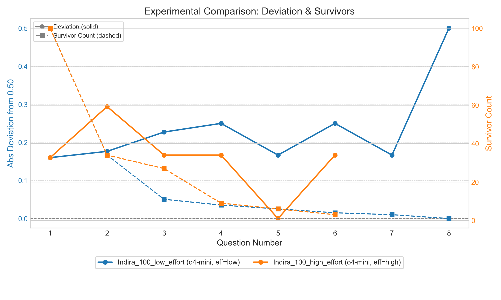

## Example Plot

Below is an example comparison of two experiments: one with "low" reasoning effort (baseline) and another with "high" reasoning effort, both attempting to identify Indira Gandhi from a list of 100 people:



The solid lines show how far each question was from achieving a perfect 50/50 split of the remaining candidates (lower is better). The dashed lines show how many candidates remained after each question.
# Guess Who Game with OpenAI CLI

A Python command-line application that plays a "guess the character" game using OpenAI models. It reads a list of names from a text file, lets the model ask yes/no questions to identify a hidden target, and evaluates how efficiently the model splits the remaining possibilities at each step.

## Features

### Game Engine (`guess_name.py`)

* Load a list of characters from a plain-text file (`input_list.txt`).
* Choose a target name explicitly or at random.
* Generate yes/no questions using any OpenAI chat model (e.g. `gpt-3.5-turbo`, `o4-mini`).
* Answer questions with an oracle model (`yes`, `no`, or `successful_guess`).
* Fully asynchronous oracle evaluation – all surviving candidates are queried in parallel for speed.
* Records per-question metrics:
  * **Deviation** of the yes/no split from the ideal 0.50.
  * **Survivor count** after filtering.
  * Raw yes/no counts.
* Saves everything to `experiments/<experiment_name>/`:
  * `params.json` – the exact CLI parameters & models used.
  * `results.jsonl` – one JSON line per question with all computed metrics.

### Plotting Utility (`plot_experiments.py`)

* Combine and visualise any number of experiments on one chart.
* Deviation plotted as solid lines, survivor counts as dashed lines on a secondary y-axis.
* Automatic colour assignment per experiment + dual legends explaining colour vs. line style.
* Save to PNG with `--output` or interactively display.

### Workflow Highlights

* Run many parameter sweeps (`--experiment-name`) without manual bookkeeping – every run is archived.
* Compare variants side-by-side in a single command.
* Extendable: the JSONL format is easy to post-process in your own analysis scripts.

## Prerequisites

- Python 3.8 or higher
- An OpenAI API key with access to your chosen models

## Installation

1. Clone this repository:
   ```bash
   git clone https://github.com/harshit711/Guess-Who-LLM.git
   cd guess-who-questions
   ```
2. Create and activate a virtual environment:
   ```bash
   python3 -m venv venv
   source venv/bin/activate
   ```
3. Install dependencies:
   ```bash
   pip install -r requirements.txt
   ```
4. Set your OpenAI API key:
   ```bash
   export OPENAI_API_KEY="sk-your-key-here"
   ```

## Input File Format

Create `input_list.txt` with one name per line, for example:
```
Frida Kahlo
Gabriel García Márquez
Leonardo DiCaprio
Beyoncé Knowles
Billie Jean King
Marie Curie
Ada Lovelace
Nelson Mandela
Aristotle
Steve Jobs
```

## Usage

```bash
# Run a game and save as experiment "baseline_low"
python guess_name.py input_list.txt \
  --model gpt-3.5-turbo \
  --oracle-model o4-mini \
  --reasoning-effort low \
  --max-rounds 20 \
  --experiment-name baseline_low

# Compare two experiments
python plot_experiments.py baseline_low another_experiment --output comparison.png
```

## Development

CLI powered by [Typer](https://typer.tiangolo.com/).
Async interaction via `openai.AsyncOpenAI`.
Visualisation with [Matplotlib](https://matplotlib.org/) and Seaborn palette.

## License

This project is released under the MIT License. Feel free to adapt and extend! 
